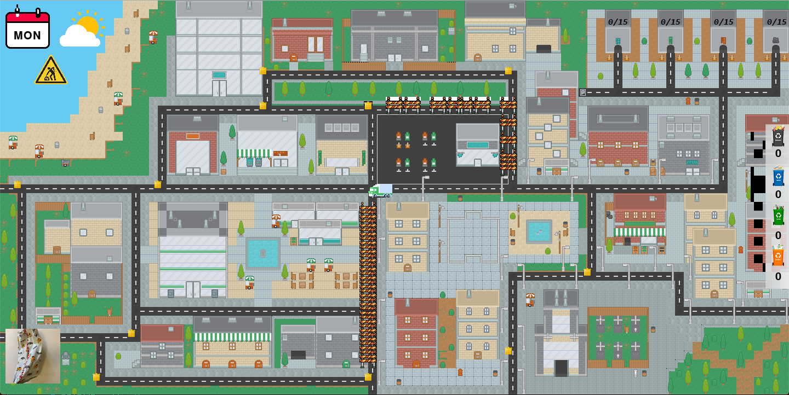
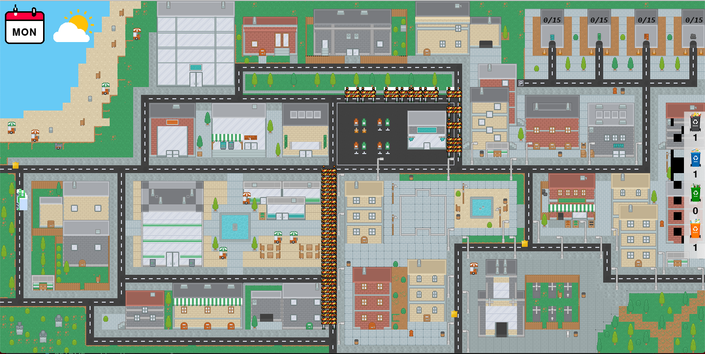

# Inteligent Garbage Truck AI
> 

## Table of contents
- [Inteligent Garbage Truck AI](#inteligent-garbage-truck-ai)
  - [Table of contents](#table-of-contents)
  - [Task Description](#task-description)
  - [Our solution](#our-solution)
  - [Screenshots](#screenshots)
  - [Technologies](#technologies)
  - [Setup](#setup)
  - [Features](#features)
  - [Status](#status)
  - [Contact](#contact)

## Task Description
The task of an inteligent garbage truck is to autonomously gather waste from dustbins. The truck should recognize the types of dustbins, look inside the dustbins and check if the garbage is correctly sorted, empty the bins, move the waste to the landfill and offload it in a suitable place.

## Our solution
To solve this task we used:
- `pygame` for `agent environment representation`
- `BFS` algorith to implement `uninformed search strategies` in our project
- `A*` algorith to implement `informed search strategies` in our project
- `Learning Methods`:
  * `Decision Trees` (we used them to make decision if the garbage truck should take the trash or not by specific arguments like:
    - Trash size
    - Trash weight
    - Space on the trash yard
    - And much more
  * `Neural Networks` (we used them to recognize type of trash by its image)
  * `Genetic Algorithms` (we used it to solve `Travelling salesman problem`)

## Screenshots

## Technologies
* python
* pygame library (For environment representation) 
* sklearn library (For Decision Trees)
* keras library (For Neural Networks)

## Setup
1. To run this project you need to download `python`.

## Features
* 

## Status
Project is: _completed_

## Contact
Created by :
- [@HondaPL](https://hacia.students.wmi.amu.edu.pl/)
- [@SmoothCrimminal](https://github.com/SmoothCrimminal)
- [@Maciasty15](https://github.com/Maciasty15)
- [@Kajgal](https://github.com/kajgal)

2021

